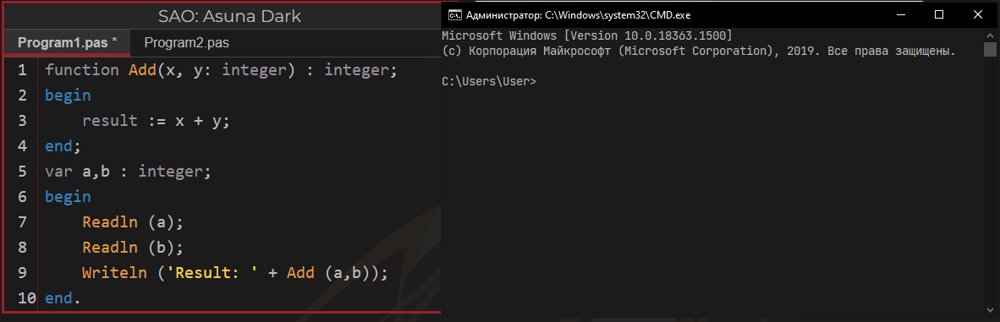
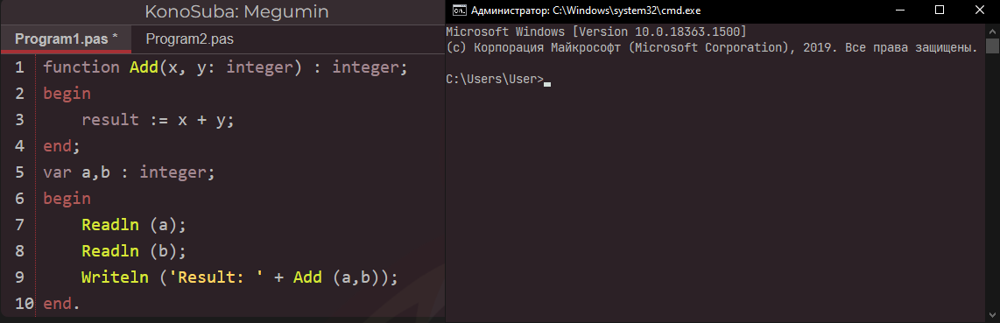

By this you can set any hex color to cmd. 

To do that, open the program. Press 1 bg (if you want to set background. fg if you want to set foreground)

Next write hex color. Color will be set automatically.

